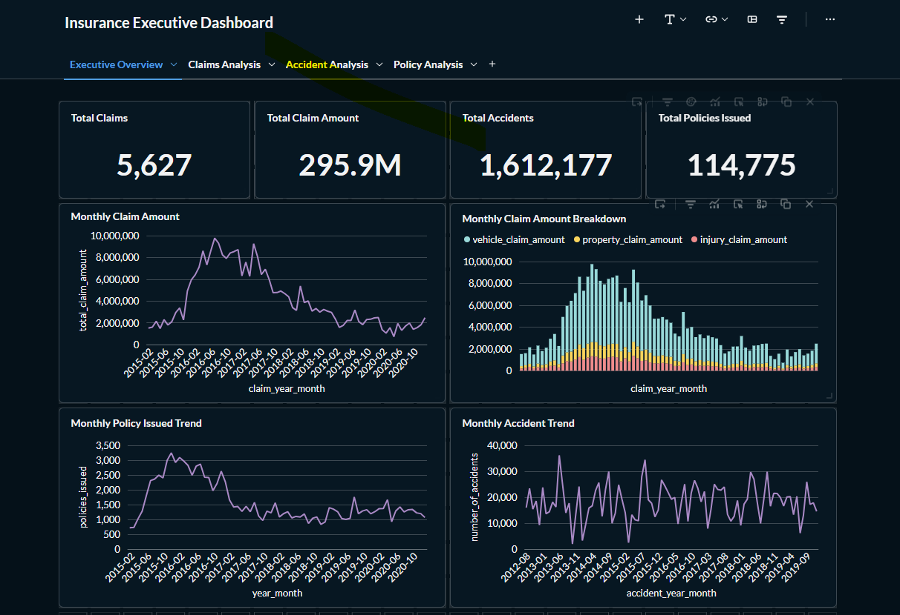
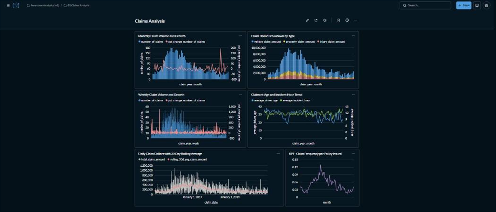
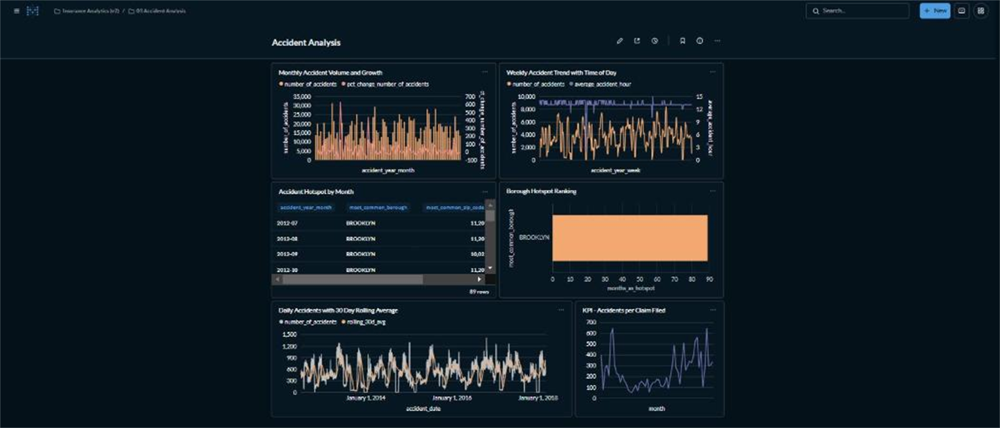
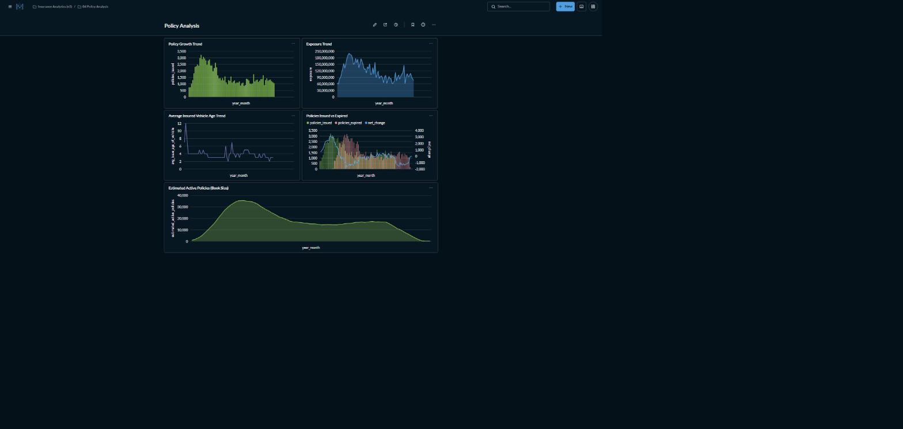
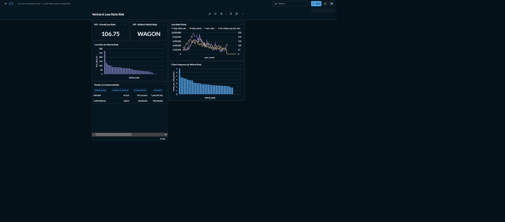

# Insurance Data Engineering Pipeline

An end-to-end insurance data engineering project implementing a Medallion Architecture (Bronze → Silver → Gold) using PySpark, Delta Lake, Great Expectations, Airflow, SQL, ClickHouse, and Metabase — runnable either on Databricks or entirely locally via Docker Compose.

The pipeline transforms raw insurance data into analytics-ready Gold tables, validates it against an explicit data-quality gate, loads it into ClickHouse, and provides interactive BI dashboards for business analysis.

---

## Architecture

```
MySQL / MongoDB / S3 (raw sources)
    |
    v
Bronze Layer            \
(Raw Ingestion)           \
    |                       \
    v                         >  orchestrated by Airflow
Silver Layer                 /   (docker-compose: ingest -> silver -> quality -> gold -> load)
(Cleaning & Transformation) /
    |
    v
Data Quality Gate (Great Expectations)
    |
    v
Gold Layer
(Business Aggregations)
    |
    v
ClickHouse
    |
    v
Metabase Dashboard
```

Bronze/Silver/Gold transform logic lives once, in `src/insurance_pipeline/`, and is shared by every entrypoint below — it isn't duplicated between Databricks and local/Airflow.

---

## Technologies

- Python
- PySpark
- Apache Spark
- Delta Lake
- Databricks (cloud execution)
- Apache Airflow (orchestration)
- Great Expectations (data quality)
- Docker / Docker Compose (local execution)
- ClickHouse
- Metabase
- GitHub Actions (CI: lint + tests)
- pytest, ruff, black

---

## Data Domains

The pipeline processes three main insurance domains:

- Claims
- Accidents
- Policies

---

# Medallion Architecture

## Bronze Layer

The Bronze layer stores raw ingested data with minimal transformation.

Tables:

```
bronze_claims
bronze_accidents
bronze_policies
```

---

## Silver Layer

The Silver layer performs data cleaning and standardization.

Operations:

- Schema validation
- Data type standardization
- Data cleaning
- Date parsing

Tables:

```
silver_claims
silver_accidents
silver_policies
```

---

## Data Quality Gate

Between Silver and Gold, `insurance_pipeline.quality` runs a Great Expectations suite against each Silver table (required fields not null, values within valid ranges, e.g. `incident_hour` between 0–24, non-negative claim amounts, valid latitude/longitude). A failed expectation raises `DataQualityError`, which fails the pipeline (the Airflow `data_quality_checks` task) instead of letting bad data flow silently into Gold.

The raw sample data has real invalid rows — negative premiums, GPS coordinates outside valid Earth latitude/longitude — that aren't null, so they'd sail straight through a null-check. The Silver transforms filter these out directly (defense in depth), with the Great Expectations suite as a second, independent check that the filtering actually worked.

---

## Gold Layer

The Gold layer creates business-ready analytical tables for reporting and BI visualization.

### Claims Analytics

Tables:

```
gold_claims_daily
gold_claims_weekly
gold_claims_monthly
```

Includes:

- Number of claims
- Total claim amount
- Claim trends
- Rolling averages
- Growth metrics

---

### Accident Analytics

Tables:

```
gold_accidents_daily
gold_accidents_weekly
gold_accidents_monthly
```

Includes:

- Accident frequency
- Accident trends
- Time-based analysis
- Geographic insights

---

### Policy Analytics

Table:

```
gold_policies_monthly
```

Includes:

- Policies issued
- Policies expired
- Exposure metrics
- Total premium written
- Vehicle age analysis

---

### Loss Ratio & Vehicle Risk Analytics

Tables:

```
gold_loss_ratio_monthly
gold_vehicle_body_risk
gold_vehicle_usage_risk
```

These three are the only Gold tables that actually join Claims and Policies
(everything above aggregates one domain over time, independently of the
other) — loss ratio and per-vehicle-segment risk both require attributing a
claim back to the policy, and the vehicle, it was filed against. See the
module docstring in `insurance_pipeline.gold` for how the join is structured
(month-level for loss ratio, row-level for vehicle segments, to avoid
double-counting a policy's premium across multiple claims in the same
month).

Includes:

- Monthly loss ratio (incurred claims ÷ written premium), with a 3-month
  rolling average
- Claim frequency, severity, and loss ratio by vehicle body type
- Claim frequency, severity, and loss ratio by vehicle usage (private vs.
  commercial)

---

# Orchestration

`dags/insurance_pipeline_dag.py` defines an Airflow DAG that runs the pipeline end-to-end:

```
ingest_bronze >> transform_silver >> data_quality_checks >> build_gold >> load_clickhouse
```

Each task shells out to a dedicated Python virtualenv baked into the Airflow image (`docker/airflow/Dockerfile`) containing PySpark, Delta Lake, Great Expectations, and this repo's `insurance_pipeline` package — kept separate from Airflow's own Python environment so Great Expectations' dependency tree can't collide with Airflow's.

---

# Metabase Dashboard

The Gold layer is loaded into ClickHouse (via `insurance_pipeline.clickhouse_loader`, run as the final DAG task) and visualized through Metabase dashboards.

The SQL behind every card on every dashboard below lives in `metabase_queries/` — one `.sql` file per card, grouped into one folder per dashboard, ready to paste into Metabase's SQL editor. See `metabase_queries/README.md` for how to wire them up. Every query only touches columns that actually exist on the Gold tables (`docker/clickhouse/init.sql` has the exact schema) — nothing here is a plausible-looking panel built on data that isn't there.

## Executive Overview

5 cards, from `metabase_queries/01_executive_overview/`:

- Total claims and total claim amount (all-time)
- Total accidents (all-time)
- Total policies issued (all-time)
- Overall business trend: claims, accidents, and policies issued on one monthly timeline
- Average claim severity (dollars per claim)

---

## Claims Analysis

5 cards, from `metabase_queries/02_claims_analysis/`:

- Monthly claim volume and month-over-month growth
- Claim amount breakdown by type (injury / property / vehicle) per month
- Weekly claim volume and growth (finer-grained than monthly)
- Average claimant driver age and incident hour, over time
- Daily claim amount with a 30-day rolling average overlaid

---

## Accident Analysis

5 cards, from `metabase_queries/03_accident_analysis/`:

- Monthly accident volume and month-over-month growth
- Weekly accident volume (finer-grained than monthly)
- Most accident-prone borough/zip code each month (a true mode — see below)
- Ranking of which borough has been the monthly hotspot most often
- Daily accident count with a 30-day rolling average overlaid

The `most_common_borough`/`most_common_zip_code` columns are a real per-period mode (the value that actually occurs most often), not just the alphabetically-largest value — an early version of `gold.py` used `MAX()` for this, which is a different (and wrong) thing; see `insurance_pipeline.gold._modes_per_group`.

---

## Policy Analysis

5 cards, from `metabase_queries/04_policy_analysis/`:

- Policy growth trend (new policies issued per month)
- Exposure trend (total sum-insured written per month)
- Vehicle age trend (average age of insured vehicle at issuance)
- Policies issued vs. expired per month (growth vs. churn)
- Estimated active policy count over time (cumulative issued − cumulative expired)

---

## Vehicle & Loss Ratio Risk

6 cards, from `metabase_queries/05_vehicle_and_loss_ratio_risk/`:

- Overall portfolio loss ratio (all-time)
- Riskiest vehicle body type (highest loss ratio among segments with enough
  policies to be meaningful)
- Monthly loss ratio trend, with a 3-month rolling average
- Loss ratio by vehicle body type
- Claim frequency (claims per 100 policies) by vehicle body type
- Private vs. commercial risk comparison

Unlike the other four dashboards, this one is built from a real
claims-to-policies join rather than independent time-series aggregates —
see [Loss Ratio & Vehicle Risk Analytics](#loss-ratio--vehicle-risk-analytics)
above.

---

## Dashboard Screenshots

Screenshots are available in:

```
images/
```

### Executive Overview



### Claims Analysis



### Accident Analysis



### Policy Analysis



### Vehicle & Loss Ratio Risk



---

# Project Structure

```
insurance-data-engineering/

├── src/insurance_pipeline/   # Bronze/Silver/Gold/quality/ClickHouse logic (shared by every entrypoint below)
│   ├── config.py
│   ├── spark_utils.py
│   ├── bronze.py
│   ├── silver.py
│   ├── gold.py
│   ├── quality.py
│   ├── clickhouse_loader.py
│   └── run.py                # CLI: python -m insurance_pipeline.run {bronze,silver,quality,gold,clickhouse,all}
│
├── notebooks/                 # Thin Databricks entrypoints that call into src/insurance_pipeline
│   ├── bronze.py
│   ├── silver.py
│   └── gold.py
│
├── dags/
│   └── insurance_pipeline_dag.py
│
├── docker/
│   ├── airflow/Dockerfile
│   ├── mysql/init.sql
│   ├── mongo/init-mongo.sh
│   └── clickhouse/init.sql
│
├── tests/                      # pytest, against a local SparkSession
│
├── metabase_queries/            # One .sql file per Metabase dashboard card, grouped by dashboard
│
├── data/
│   ├── samples/                # Sample MySQL/MongoDB/S3 source data
│   └── schemas/                # Column-rename/type schemas consumed by silver.py
│
├── setup/                      # Cloud provisioning reference (RDS/Fivetran MySQL grants, Atlas MongoDB seeding) — not used by Docker Compose
│
├── images/
│
├── docker-compose.yml
├── pyproject.toml
└── README.md
```

---

# How to Run

## Locally, with Docker Compose (no Databricks account needed)

```bash
docker compose up -d --build
```

This starts Postgres (Airflow's metadata DB), the Airflow webserver (http://localhost:8080, admin/admin) and scheduler, MySQL/MongoDB (seeded with the sample data), and ClickHouse.

Trigger the pipeline:

```bash
docker compose exec airflow-webserver airflow dags trigger insurance_pipeline_dag
```

Then query the loaded Gold tables:

```bash
docker compose exec clickhouse clickhouse-client --query "SELECT * FROM insurance.gold_claims_monthly"
```

## On Databricks

1. Clone the repository (e.g. as a Databricks Repo).
2. Open `notebooks/bronze.py`, `notebooks/silver.py`, `notebooks/gold.py` and run them in order — each `%pip install -e ..`s the `insurance_pipeline` package from the repo checkout, then calls the same `run_bronze`/`run_silver`/`run_gold` functions used locally.
3. Load the Gold Delta tables into ClickHouse (`insurance_pipeline.clickhouse_loader.run_clickhouse_load`, or your own job) and connect ClickHouse to Metabase for dashboard visualization.

## Local development (without Docker)

```bash
python -m venv .venv && .venv/bin/pip install -e ".[dev]"
pytest -q
ruff check . && black --check .
```

Requires a JDK (11 or 17) on `PATH`/`JAVA_HOME` for PySpark. On Windows, Delta Lake's package resolution needs `winutils.exe` on `HADOOP_HOME`; Docker Compose avoids that entirely and is the recommended local path.

---

# CI

GitHub Actions (`.github/workflows/ci.yml`) runs `ruff`, `black --check`, and `pytest` against the sample data on every push/PR. It validates code correctness with a local SparkSession; it does not stand up the full Docker Compose/Airflow stack — that's the local/demo path described above.

---

## Author

Yasna Kazemghamsari

Data Engineering | PySpark | Databricks | Data Analytics
